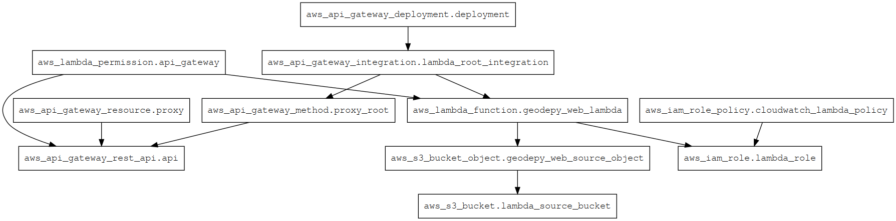

# GeodePy web

Web application for [GeodePy](https://github.com/GeoscienceAustralia/geodesy-package)

(image generated with: `terraform graph | grep -Ev "meta.count-boundary|local.|var.|output.|data.aws_caller_identity.current|provider." | dot -Tpng > infrastructure-graph.png`)
